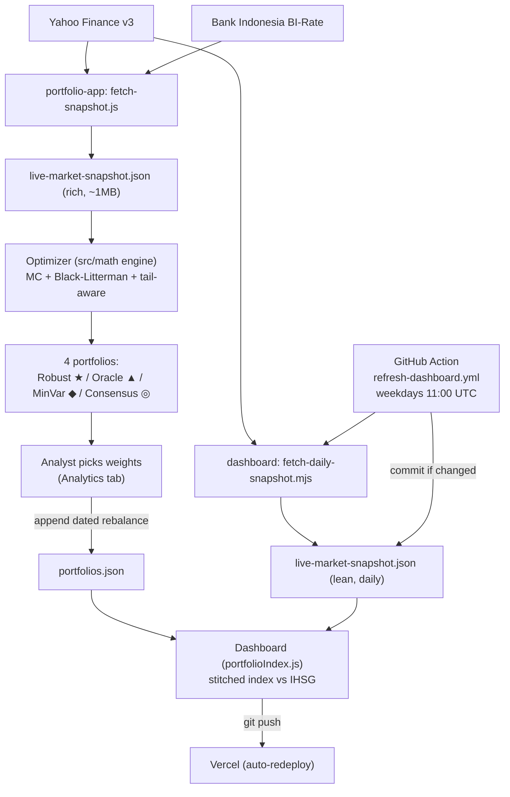

# ARCHITECTURE.md

## Monorepo layout

```
my-portfolio-app/
├── CLAUDE.md, API.md, ASSUMPTIONS.md, ARCHITECTURE.md, GLOSSARY.md, CONTRIBUTING.md
├── README.md
├── .claude/                       # agents + skills (see CLAUDE.md)
├── .github/workflows/
│   ├── refresh-dashboard.yml       # CI cron: daily lean dashboard snapshot
│   ├── refresh-views.yml           # CI cron: weekly analyst-view capture (→ view-history/)
│   ├── weekly-rebalance.yml        # CI cron: automated weekly rebalance (runs optimize.mjs)
│   └── refresh-bi-rate.yml         # CI cron: weekday BI-Rate archive update (→ bi-rate.json, portfolios.json)
│
├── portfolio-app/                  # OPTIMIZER — local research tool
│   ├── data/
│   │   ├── universe.js              # UNIVERSE_JK (research) + FORWARD_TEST_UNIVERSE_JK (pinned, live)
│   │   ├── fetch-snapshot.js        # Yahoo + BI-Rate → live-market-snapshot.json (~1MB)
│   │   ├── refresh-sectors.js       # update sector labels only
│   │   ├── live-market-snapshot.json (generated)
│   │   └── view-history/            # weekly trimmed analyst-view captures (~5KB each, for κ-replay)
│   ├── optimizer-config.json        # methodology config for the headless optimizer
│   ├── scripts/
│   │   ├── validate-factors.mjs     # math regression suite
│   │   ├── optimize.mjs             # headless rebalance (per-config: --methodology/--prior-mode/--tau/--emit)
│   │   └── seed-forward-matrix.mjs  # sequential, resumable seed of the full 10-config matrix
│   ├── src/
│   │   ├── App.jsx                  # 4-tab UI
│   │   ├── components/              # EfficientFrontier.jsx, CorrelationExplorer.jsx
│   │   └── math/                    # pure modules — the quant engine (shared by the backtester)
│   ├── README.md                    # deep math walkthrough (authoritative)
│   └── CALIBRATION.md               # prescriptive tuning
│
├── backtest-portfolio/             # BACKTESTER — local, cost-aware walk-forward
│   ├── scripts/
│   │   ├── fetch-backtest-history.mjs  # full daily+weekly history + dollar-vol + shares-out
│   │   ├── run-strategy-backtest.mjs   # precompute tail-aware variants × frequency × κ-sweep
│   │   └── generate-reference-artifacts.mjs  # sharded reference backtest
│   ├── public/*.json                # history + shards regenerated (gitignored); the 3 canonical backtest-results*.json ARE committed (main one refreshed by weekly CI)
│   ├── src/backtestEngine.js        # imports portfolio-app/src/math; net-of-cost engine
│   └── README.md
│
├── live-dashboard-portfolio/       # TRACKER — Vercel production
    ├── data/
    │   ├── live-market-snapshot.json (generated by CI, ~14KB daily; carries dollarVol)
    │   └── portfolios.json          # methodology-matrix × κ weight history (300 streams; manual or via cron)
    ├── scripts/
    │   ├── fetch-daily-snapshot.mjs    # lean daily snapshot incl. dollarVol
    │   ├── init-portfolios-matrix.mjs  # (re)init the empty 300-stream skeleton
    │   ├── add-kappa-streams.mjs       # additively add κ>0 skeletons to a seeded file
    │   ├── backseed-kappa.mjs          # one-shot: seed κ>0 history for existing effective dates
    │   ├── lib/kappaExpand.mjs         # shared axes + κ blend helpers (mirrors backtester)
    │   └── merge-rebalances.mjs        # assemble per-config emits → portfolios.json + κ-expand
    ├── src/math/                    # portfolioIndex.js, priceAlign.js, transactionCosts.js (derived net-of-cost), attribution.js
│   ├── vercel.json
│   └── README.md                    # deploy + rebalance workflow
│
├── api/                            # WORKBENCH BACKEND — Vercel Node functions (repo root)
│   ├── _lib/yahoo.mjs               # shared fetch/serialise + Jakarta calendar + BI-Rate (`_` = not a route)
│   ├── _lib/http.mjs                # JSON/cache-header helpers
│   ├── ticker.mjs                   # ?symbol= → one name's weekly + daily + meta + analyst views
│   ├── benchmark.mjs                # IHSG (^JKSE) weekly
│   ├── rf.mjs                       # live BI-Rate (fallback 5.75%)
│   └── resolve.mjs                  # ?symbol= → validate a typed ticker before fetching it
│
├── workbench/                      # WORKBENCH UI — the deployed unified site
│   ├── src/Shell.jsx                # top nav: OPTIMIZER | BACKTEST | UNIVERSE
│   ├── src/universe/                # UniverseContext, marketDataClient (fan-out + contract adapters), UniversePanel
│   ├── scripts/stage-reference-artifacts.mjs  # copies backtest-results*.json in at build time
│   └── vite.config.js               # fs.allow ['..'] + dev middleware mounting ../api/*.mjs
│
├── vercel.json                     # builds workbench/, serves /api (Vercel Root Directory = repo root)
└── package.json                    # deps for /api only — NO workspaces field
```

## Responsibilities

- **`portfolio-app`** is where research happens. It pulls a rich snapshot, runs the full quant engine in-browser, and presents four candidate portfolios on an efficient frontier. It is **never deployed** — it stays on the analyst's machine. It produces *weights*. It also hosts the headless `optimize.mjs` (same engine, no UI) that the automated weekly rebalance runs.
- **`backtest-portfolio`** is the **evidence layer**. It reuses `portfolio-app/src/math` to run the construction machinery (tail-aware Max-Sharpe + tail-λ variants, min-variance, equal-weight) walk-forward and look-ahead-free over historical prices, **net of an IDX transaction-cost model** (gross alongside), across weekly/monthly/quarterly with a turnover-penalty (κ) sweep. Local only; the raw history and per-prior shards are regenerated (gitignored), while the three canonical `backtest-results*.json` artifacts are committed (weekly CI refreshes the main `backtest-results.json`; the `-shrunk`/`-equal` variants are regenerated locally via `generate-reference-artifacts.mjs`).
- **`live-dashboard-portfolio`** is the public scoreboard. It tracks the *chosen* weights against IHSG using a lean daily snapshot, compounding an index continuously from inception. It holds **no optimization code** — only index stitching plus a small **derived** layer: rebalance frequency (weekly/monthly/quarterly) and gross/net-of-cost (liquidity-aware trailing-63 ADV via `transactionCosts.js`, fed by the snapshot's `dollarVol`) are computed in-browser, not stored.

- **`workbench` + `api`** is the **deployed research surface**. It does not fork either app: `Shell.jsx` imports `portfolio-app/src/App.jsx` and `backtest-portfolio/src/App.jsx` in place and hands each one its data as a prop, so both still run standalone on :5173 / :5174 against their static files. What it adds is a **live, editable ticker universe** — `/api/ticker` fetches one name at a time from Yahoo and `marketDataClient.js` reshapes the results into the exact `live-market-snapshot.json` and `backtest-history.json` contracts the engines already consume, so **no math changed**. Universe edits are session-local (`localStorage`); the canonical list stays `portfolio-app/data/universe.js`.

The bridge to the dashboard is `portfolios.json` — now a **methodology matrix × κ of 300 streams = 10 configs × 6 variants × 5 κ** (config = `pert` + BL × prior{cap,shrunk,equal} × τ{0.01,0.03,0.10}; κ = turnover penalty {0,0.1,0.25,0.5,0.75}; stream id = `<base>@<configTag>` for κ=0, `-k<KK>` suffix for κ>0). It is appended **either by hand** (the analyst reads weights off the optimizer's Analytics tab) **or automatically** by the weekly rebalance Action — a parallel config matrix where each `optimize.mjs --emit` job writes only its 6 κ=0 streams and a `merge-rebalances.mjs` step assembles them **and synthesizes the κ>0 variants** (post-hoc blend toward drift) and **commits directly to `main`** (no PR; the push auto-redeploys Vercel — the merge script fails the job rather than pushing malformed weights). Separately, `refresh-views.yml` captures point-in-time analyst views weekly into `portfolio-app/data/view-history/` so the live strategy can later be κ-replayed at higher fidelity.

## Data flow



## Optimizer pipeline (order of operations)

Inside a REGENERATE run (`runMonteCarloSimulation` in `monteCarlo.js`):

1. **Correlation** ρ from the chosen weekly window (`computeCorrelationFromDateRange`).
2. **Covariance** Σ from ρ × annualized theta-decayed σ, with optional Ledoit-Wolf shrinkage (`computeCovarianceMatrix`).
3. **Expected returns** per Monte Carlo path via Beta-PERT over analyst targets; optional Black-Litterman blend toward an equilibrium prior — `cap`, `shrunk`, or `equal` via `applyPriorMode` — with the prior-vs-views blend set by τ (`buildScenarioBank`, `blackLitterman.js`).
4. **Optimization** on a 1000-path subsample with the tail-aware objective `Sharpe − λ·tailGap − κ·turnover` (`buildObjectiveFn`, `robustObjective.js`).
5. **Reporting** on the full path bank: efficient-frontier cloud, λ frontier, stress scenarios, IHSG beta/active-risk (`evaluateStressScenarios`, `benchmarkMetrics.js`).

## Optimizer UI (4 tabs, `App.jsx`)

| Tab | Purpose |
|-----|---------|
| **Workspace** | toggle the active universe; set sector/position caps, vol half-life, tail penalty λ, factor-model config |
| **Correlation** | pick the correlation date window; price chart (rebased to 100) + live ρ matrix (`CorrelationExplorer.jsx`) |
| **Simulation** | REGENERATE → efficient-frontier scatter with the 4 portfolios (`EfficientFrontier.jsx`) |
| **Analytics** | weights, risk contributions, stress results, IHSG metrics, rebalance trades — **the numbers you copy into `portfolios.json`** |

## Dashboard index stitching

Each daily bar compounds: `index_t = index_{t-1} · exp(Σ wᵢ(t)·rᵢ,t)`, where `wᵢ(t)` is the weight active on/before that bar's date (`weightsAtDate`). The index **never resets** on rebalance — adding a new `effective` row only changes the future slope. IDX holidays/weekends have no bar; the next trading day's return spans the gap.

## Deployment & CI

- **Dashboard → Vercel.** `vercel.json` sets framework `vite`, install `npm ci`, build `npm run build`, output `dist`, with SPA rewrites. In the Vercel project, **Root Directory = `live-dashboard-portfolio`**. Every `git push` auto-redeploys.
- **Optimizer:** local only; `npm run build` produces `dist/` but it isn't deployed.
- **CI cron** (`.github/workflows/refresh-dashboard.yml`): weekdays at **11:00 UTC (18:00 WIB)**, after IDX close. Steps: checkout → Node 20 → `npm ci` in the dashboard → `npm run fetch-snapshot` (with `NODE_OPTIONS=--max-old-space-size=512`) → commit `live-dashboard-portfolio/data/live-market-snapshot.json` **only if changed** → push (triggers Vercel). This is the source of the recurring `chore: refresh IDX daily snapshot` commits.
- **BI-Rate CI cron** (`.github/workflows/refresh-bi-rate.yml`): **weekdays 09:00 UTC (16:00 WIB)**, after Bank Indonesia's Board-of-Governors announcement window and 2h clear of the dashboard snapshot job so the two don't race on a push to `main`. Steps: checkout → Node 20 (**no `npm ci`** — the scraper needs only global `fetch` + `fs`) → `node portfolio-app/data/refresh-bi-rate.js` → report archive coverage + any seed conflicts → on change, `sync-risk-free-rate.mjs` patches `portfolios.json` → commit both. Writes only when the rate or history actually moved, so this lands ~8 commits/year (BI's meeting calendar), not ~250. A failed scrape is **not** a job failure — the archive is still valid and every consumer keeps resolving from it.
  - **This job exists for the live forward test, and only for it.** The optimizer and the backtest read `bi-rate.json` directly and refresh it in their own `predev`, so they are current by construction. The tracker is deployed to Vercel and builds from committed data, so it is the one consumer a rate move reaches only if something writes it in.
- **Backtest: no CI cron.** It used to run weekly and commit `backtest-results.json`. Removed, because the two things it did are now done better locally: `npm run dev` refetches the price history (`fetch-if-stale` skips when the file already covers the last completed session), and the Reference panel's **Regenerate** button rebuilds the artifact over whatever universe is selected. A committed artifact was a stale copy of a one-click rebuild, and it went out of date against `universe.js` every time a ticker changed. **Nothing in `backtest-portfolio/public/` is committed.**
