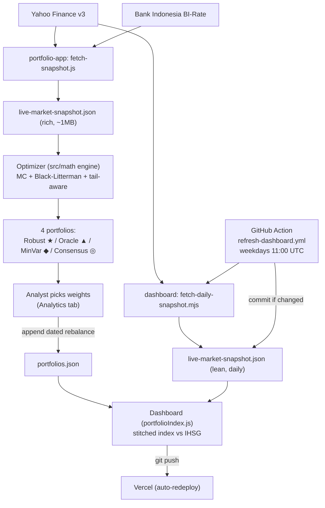

# ARCHITECTURE.md

## Monorepo layout

```
my-portfolio-app/
├── CLAUDE.md, API.md, ASSUMPTIONS.md, ARCHITECTURE.md, GLOSSARY.md, CONTRIBUTING.md
├── README.md
├── .claude/                       # agents + skills (see CLAUDE.md)
├── .github/workflows/
│   └── refresh-dashboard.yml       # CI cron: daily dashboard snapshot refresh
│
├── portfolio-app/                  # OPTIMIZER — local research tool
│   ├── data/
│   │   ├── fetch-snapshot.js        # Yahoo + BI-Rate → live-market-snapshot.json (~1MB)
│   │   ├── refresh-sectors.js       # update sector labels only
│   │   └── live-market-snapshot.json (generated)
│   ├── scripts/validate-factors.mjs # math regression suite
│   ├── src/
│   │   ├── App.jsx                  # 4-tab UI
│   │   ├── components/              # EfficientFrontier.jsx, CorrelationExplorer.jsx
│   │   └── math/                    # 10 pure modules — the quant engine
│   ├── README.md                    # deep math walkthrough (authoritative)
│   └── CALIBRATION.md               # prescriptive tuning
│
└── live-dashboard-portfolio/       # TRACKER — Vercel production
    ├── data/
    │   ├── live-market-snapshot.json (generated by CI, ~14KB daily)
    │   └── portfolios.json          # hand-maintained weight history
    ├── scripts/fetch-daily-snapshot.mjs
    ├── src/math/                    # portfolioIndex.js, priceAlign.js (index stitching only)
    ├── vercel.json
    └── README.md                    # deploy + rebalance workflow
```

## Responsibilities

- **`portfolio-app`** is where research happens. It pulls a rich snapshot, runs the full quant engine in-browser, and presents four candidate portfolios on an efficient frontier. It is **never deployed** — it stays on the analyst's machine. It produces *weights*.
- **`live-dashboard-portfolio`** is the public scoreboard. It tracks the *chosen* weights against IHSG using a lean daily snapshot, compounding an index continuously from inception. It holds **no optimization code** — only index stitching.

The bridge between them is **human judgment + two JSON files**: the analyst reads weights off the optimizer's Analytics tab and appends them to `portfolios.json`.

## Data flow



## Optimizer pipeline (order of operations)

Inside a REGENERATE run (`runMonteCarloSimulation` in `monteCarlo.js`):

1. **Correlation** ρ from the chosen weekly window (`computeCorrelationFromDateRange`).
2. **Covariance** Σ from ρ × annualized theta-decayed σ, with optional Ledoit-Wolf shrinkage (`computeCovarianceMatrix`).
3. **Expected returns** per Monte Carlo path via Beta-PERT over analyst targets; optional Black-Litterman blend toward the cap-weight prior (`buildScenarioBank`, `blackLitterman.js`).
4. **Optimization** on a 1000-path subsample with the tail-aware objective `Sharpe − λ·tailGap − κ·turnover` (`buildObjectiveFn`, `robustObjective.js`).
5. **Reporting** on the full path bank: efficient-frontier cloud, λ frontier, stress scenarios, IHSG beta/active-risk (`evaluateStressScenarios`, `benchmarkMetrics.js`).

## Optimizer UI (4 tabs, `App.jsx`)

| Tab | Purpose |
|-----|---------|
| **Workspace** | toggle the active universe; set sector/position caps, vol half-life, tail penalty λ, factor-model config |
| **Correlation** | pick the correlation date window; price chart (rebased to 100) + live ρ matrix (`CorrelationExplorer.jsx`) |
| **Simulation** | REGENERATE → efficient-frontier scatter with the 4 portfolios (`EfficientFrontier.jsx`) |
| **Analytics** | weights, risk contributions, stress results, IHSG metrics, rebalance trades — **the numbers you copy into `portfolios.json`** |

## Dashboard index stitching

Each daily bar compounds: `index_t = index_{t-1} · exp(Σ wᵢ(t)·rᵢ,t)`, where `wᵢ(t)` is the weight active on/before that bar's date (`weightsAtDate`). The index **never resets** on rebalance — adding a new `effective` row only changes the future slope. IDX holidays/weekends have no bar; the next trading day's return spans the gap.

## Deployment & CI

- **Dashboard → Vercel.** `vercel.json` sets framework `vite`, install `npm ci`, build `npm run build`, output `dist`, with SPA rewrites. In the Vercel project, **Root Directory = `live-dashboard-portfolio`**. Every `git push` auto-redeploys.
- **Optimizer:** local only; `npm run build` produces `dist/` but it isn't deployed.
- **CI cron** (`.github/workflows/refresh-dashboard.yml`): weekdays at **11:00 UTC (18:00 WIB**, after IDX close). Steps: checkout → Node 20 → `npm ci` in the dashboard → `npm run fetch-snapshot` (with `NODE_OPTIONS=--max-old-space-size=512`) → commit `live-dashboard-portfolio/data/live-market-snapshot.json` **only if changed** → push (triggers Vercel). This is the source of the recurring `chore: refresh IDX daily snapshot` commits.
