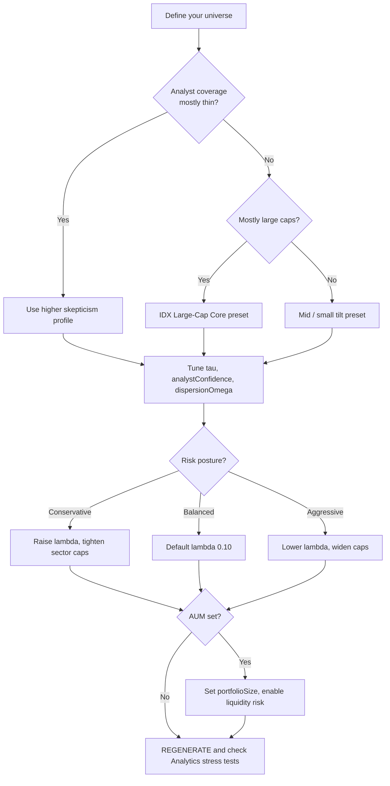

# Calibration & Setting Recommendations

This document is **prescriptive** — it tells you what values to set given your stock universe, market conditions, and risk posture. For a detailed explanation of what each parameter does mathematically, see [README.md](README.md).

The default settings in the app (`DEFAULT_FACTOR_CONFIG`, `DEFAULT_SIM_CONFIG`) are calibrated for a mixed IDX large-cap universe with typical sell-side analyst coverage. If your universe differs materially — newer listings, thinner coverage, smaller names, or a concentrated sector thesis — you should start from the profiles in this document rather than the defaults.

---

## Table of Contents

- [Before You Tune — Read the Signals](#before-you-tune--read-the-signals)
- [Universe Profiles](#universe-profiles)
- [Black-Litterman Knobs](#black-litterman-knobs)
- [Volatility Half-Life](#volatility-half-life)
- [Correlation Window](#correlation-window)
- [Tail Penalty λ and Turnover κ](#tail-penalty-λ-and-turnover-κ)
- [AUM, Liquidity, and Position Caps](#aum-liquidity-and-position-caps)
- [Monte Carlo Scale](#monte-carlo-scale)
- [Preset Bundles](#preset-bundles)
- [Recalibration Workflow](#recalibration-workflow)
- [Parameter Reference](#parameter-reference)

---

## Quick Decision Flowchart

Use this to find the right starting profile before reaching for individual sliders.



---

## Before You Tune — Read the Signals

Resist changing sliders by intuition alone. The ANALYTICS tab provides diagnostics that tell you specifically what needs adjustment. Check these signals after every REGENERATE before touching any knob.

| Analytics signal | What it suggests | Recommended action |
|-----------------|------------------|--------------------|
| Consensus ◎ Sharpe materially above Robust ★ | The tail penalty λ is too low relative to the tail gap the optimizer is seeing | Raise λ; inspect the CVaR column in the λ comparison table |
| Oracle ▲ far above Consensus ◎ | Scenario return dispersion is high — analyst targets vary widely across paths | Raise `analystConfidence` or `dispersionOmega`, or lower τ to anchor more toward equilibrium |
| Bear stress (All Low) is deeply negative relative to All Mean | Tail protection is insufficient for your risk posture | Raise λ; check whether a concentrated sector is driving the bear scenario |
| Weights cluster at sector or position caps | Constraints are binding — the optimizer wants more than you allow | Consciously decide to relax caps, or accept that the constrained optimum is the best you can do |
| Factor preview: μ_BL remains far above π for most names | BL is not applying enough skepticism to analyst views | Lower τ, raise `analystConfidence`, or raise `dispersionOmega` to widen Ω |
| Rebalance list is dominated by illiquid, small names | Optimizer is overweighting names you cannot actually trade | Set `portfolioSize`, enable liquidity risk; auto ADT caps will restrain illiquid positions |
| All portfolios (Robust, Consensus, MinVar) have nearly identical weights | Universe is too small or correlation window is very short | Verify MIN_CORR_OBS is not triggering expansion; add more names or widen the window |

For definitions of Oracle, Consensus, Robust, and stress scenarios, see [README.md — Part VII](README.md#part-vii--portfolio-outputs--constraints).

---

## Universe Profiles

The five profiles below cover the main cases you are likely to encounter when configuring the current IDX universe. Each profile lists a starting preset; treat it as a first approximation, then adjust based on the Analytics signals above.

### Profile 1 — IDX Large-Cap Core

**Who it fits.** The default 25-ticker universe (BBCA, BBRI, BMRI, TLKM, ASII, etc.) without recent IPOs. These names have long price histories dating to 2011, analyst coverage from 10–25+ firms, and liquid ADT sufficient for most portfolio sizes.

**Key characteristics:**
- Analyst target dispersion is moderate (banks and telcos are tightest; commodity-linked names are wider)
- Weekly history back to 2011 → max range gives 700+ weekly observations, well above MIN_CORR_OBS
- Sell-side optimism is structural but predictable; τ = 0.03 provides appropriate skepticism

| Setting | Recommended value | Notes |
|---------|-------------------|-------|
| `useFactorModel` | ON | Worth enabling; analyst coverage is sufficient to produce meaningful views |
| `tau` | 0.030 | IDX default; posterior lands ~50% toward analyst Q on average (higher for heavily-covered large-caps, lower for thin names) |
| `analystConfidence` | 70% | Moderate — large-cap names have 15–25 analysts, small variance in coverage |
| `dispersionOmega` | 80% | Banks/telcos are tight; commodity names inflate Ω appropriately |
| `largeCapBias` | 25% | Cap-weight exponent `1 − 2·bias` (0.5 here) — moderately flattens the cap-weight prior; **higher values tilt toward equal-weight/smaller names** |
| `volHalfLife` | 63 days | One quarter; appropriate for low-regime-change markets |
| `tailPenalty` λ | 0.10 | Light tail cushion; good starting point |
| Correlation window | Max range | 700+ weeks; stable ρ estimates |
| Sector caps | 80% default | Financials are heavily represented; keep or tighten to 60% if you want diversification |
| `portfolioSize` | 0 unless deploying | Set if you plan to execute trades |

---

### Profile 2 — Large-Cap + Recent Listings

**Who it fits.** The full default universe including NCKL, AADI, and MDKA, which listed more recently and have shorter weekly price histories. These names are commodity/mining-linked with typically higher target dispersion.

**Key characteristics:**
- The youngest listing sets `alignedHistoryRange.min` — the shared ρ window is shorter than it would be without these names
- ADT for mining names can be volatile; liquidity risk is worth enabling even for smaller AUM
- Target dispersion tends to be higher for commodity-linked names → `dispersionOmega` matters more

| Setting | Recommended value | Notes |
|---------|-------------------|-------|
| `useFactorModel` | ON | — |
| `tau` | 0.025 | Slightly more skeptical than pure large-cap; recent listings inflate view uncertainty |
| `analystConfidence` | 75% | Coverage on newer listings is thinner |
| `dispersionOmega` | 85–90% | Wide target bands on MDKA, NCKL warrant stronger Ω inflation |
| `largeCapBias` | 20% | Newer names are mid/large; reduce bias slightly |
| `volHalfLife` | 42–63 days | Monitor recent vol; 42 if post-listing vol is elevated |
| `tailPenalty` λ | 0.20 | Wider scenario dispersion → more tail risk |
| Correlation window | Max range — but verify | Confirm the window is ≥20 weeks after narrowing from recent listings |
| Sector caps | 80%; consider 70% for Mining | Commodity sector concentration can build up |

---

### Profile 3 — Mid/Small Tilt

**Who it fits.** A universe where you have deliberately added smaller or mid-cap names beyond the core 25 — for example, enabling PWON, LSIP, AMRT, or other second-tier IDX names. These names have thinner analyst coverage and wider target dispersions.

**Key characteristics:**
- Analyst count can be as low as 3–5 for mid-caps; `analystConfidence` needs to be high to reflect this uncertainty
- Price history may be shorter for some names → watch the aligned history range
- ADT is lower; setting AUM is highly recommended to prevent concentration in untradeable names

| Setting | Recommended value | Notes |
|---------|-------------------|-------|
| `useFactorModel` | ON | BL is especially valuable here to prevent optimizer from chasing thinly-covered views |
| `tau` | 0.020–0.025 | More skeptical of sell-side; mid-cap targets tend to have lower forecast accuracy |
| `analystConfidence` | 80–90% | Low-coverage names should have much wider Ω |
| `dispersionOmega` | 85–95% | Wide dispersions are common in this segment |
| `largeCapBias` | 10–15% | Reduce cap-weight dominance if you want smaller names to contribute |
| `volHalfLife` | 42–63 | Mid-caps can reprice quickly post-news; consider 42 |
| `tailPenalty` λ | 0.20–0.35 | Higher scenario dispersion → more tail protection needed |
| Sector caps | 70% | More sector diversity across a wider name set |
| `portfolioSize` | Set if deploying | ADT caps become critical for mid-caps at any meaningful AUM |

---

### Profile 4 — Speculative / High-Dispersion

**Who it fits.** A universe dominated by names with very wide analyst target spreads (e.g. `(high − low) / mean > 1.0`) and low analyst count. These names offer the potential for high returns but the optimizer's view of them should be treated with substantial skepticism.

**Key characteristics:**
- Beta-PERT samples span a very wide range → high scenario return variance
- Oracle ▲ will sit far above Consensus ◎ — be cautious about interpreting this as opportunity
- The BL prior provides a critical anchor here; without it, the optimizer can take on extreme positions

| Setting | Recommended value | Notes |
|---------|-------------------|-------|
| `useFactorModel` | ON (strongly recommended) | BL prior is essential for speculative names |
| `tau` | 0.015–0.020 | Very skeptical; cap-weight equilibrium is a strong anchor |
| `analystConfidence` | 90–100% | Few analysts → very wide Ω for those names |
| `dispersionOmega` | 90–100% | Maximum dispersion inflation |
| `largeCapBias` | 0–10% | Allow small names but don't force them into the prior |
| `volHalfLife` | 42 | Faster vol response for volatile names |
| `tailPenalty` λ | 0.35–0.50 | High scenario dispersion; tail protection is important |
| Sector caps | 60–70% | Concentrate risk by choice, not by accident |
| `portfolioSize` | Set if deploying | ADT caps prevent excessive speculative positions |

---

### Profile 5 — Custom Narrow Universe

**Who it fits.** A hand-picked set of 8–12 names where you have a specific thesis (e.g. financials-only, or a quality-focused subset). Narrow universes have fewer names to diversify across, which changes how Σ behaves.

**Key considerations:**
- With n < 10 assets and a long correlation window, sample Σ may still be well-conditioned, but Ledoit-Wolf shrinkage (on by default) provides insurance
- Sector caps at 80% may be non-binding for sector-concentrated theses — consider whether to relax or remove them
- Min Variance ◆ becomes more meaningful in narrow universes since there are fewer ways to diversify; Robust ★ and Consensus ◎ may converge

| Setting | Recommended value | Notes |
|---------|-------------------|-------|
| `useFactorModel` | ON | Even more important with few names and higher concentration risk |
| `tau` | Match the analyst quality of the specific names chosen | — |
| Correlation window | Max range | Short windows on few names produce especially noisy ρ |
| `shrinkage` | ON (already default) | Keep enabled; critical for n < 12 |
| Sector caps | Calibrate to thesis | If all names are in one sector, the cap is irrelevant; remove it |
| `tailPenalty` λ | 0.20+ | Concentration risk is higher — more tail protection is warranted |

---

## Black-Litterman Knobs

This section describes each BL slider individually: what the math does, when to raise it, when to lower it, and common mistake patterns.

### τ — Prior anchor strength (range: 0.005–0.15)

**What it does.** τ scales the prior precision `(τΣ)⁻¹` in the BL posterior. Lower τ → `(τΣ)⁻¹` is smaller → the posterior is dominated by `Ω⁻¹Q` (analyst views). Higher τ → the prior `π` is weighted more heavily → μ_BL stays closer to cap-weight equilibrium.

Wait — that sounds backwards. It is counterintuitive. The reason: a larger `(τΣ)⁻¹` in the formula means the prior side of the blend receives more weight relative to `Ω⁻¹Q`. So **higher τ = more trust in analyst views** because the prior precision amplifies the π side, which competes against the view side... actually, let's be precise:

In `μ_BL = [(τΣ)⁻¹ + Ω⁻¹]⁻¹ [(τΣ)⁻¹ π + Ω⁻¹ Q]`, when τ is very small, `(τΣ)⁻¹` → ∞, so the combined weight denominator is dominated by the prior term and μ_BL → π. When τ is large, `(τΣ)⁻¹` → 0, and μ_BL → Q.

So:
- **Lower τ → anchor toward equilibrium π** (skeptical of analysts)
- **Higher τ → follow analyst views Q more closely**

The UI labels this correctly: the leftmost preset is "Cap anchor" (τ = 0.005) and the rightmost is "Trust analysts" (τ = 0.15).

| When to **lower** τ | When to **raise** τ |
|---------------------|---------------------|
| Speculative names with inflated targets | Deep-coverage names with tight, accurate historical targets |
| Factor preview shows μ_BL far above π for most names | Factor preview shows μ_BL barely differs from π |
| Oracle ▲ >> Consensus ◎ (high view dispersion) | Oracle ▲ ≈ Consensus ◎ (views are tight) |
| Running a backtested check showing IDX sell-side optimism bias | Targeting names with consistent analyst accuracy records |

**Quick presets in the UI:**

| Label | τ value | Suggested use |
|-------|---------|---------------|
| Cap anchor | 0.005 | Maximum skepticism; effectively ignores analyst Q |
| IDX default | 0.030 | Calibrated for typical IDX sell-side optimism |
| Balanced | 0.070 | Equal trust in π and Q for well-covered names |
| Trust analysts | 0.150 | Near-full trust in analyst targets; rarely appropriate for IDX |

---

### analystConfidence (range: 0–100%)

**What it does.** This is the exponent on the analyst coverage ratio in the Ω formula:

```
coverageTerm = (maxAnalysts / analysts_i)^analystConfidence
```

A name with 5 analysts when the universe maximum is 25 has a ratio of 5. With `analystConfidence = 70%`, the coverage term is `5^0.7 ≈ 3.1`. With `analystConfidence = 100%`, it is `5^1.0 = 5.0`. This multiplicatively inflates ω_i, making the optimizer treat the thinly-covered name's view as less reliable.

| When to **raise** analystConfidence | When to **lower** analystConfidence |
|-------------------------------------|--------------------------------------|
| Universe mixes BBCA (25 analysts) with BIRD-style names (3–5 analysts) | All names have similar analyst count (15+ each) |
| You want thin-coverage names to stick closer to equilibrium | You want equal view weight regardless of coverage depth |
| Mid/small tilt profile | Pure large-cap core where coverage is uniformly deep |

**Practical note.** At 0%, analyst count has no effect on Ω — all names are treated identically. At 100%, BIRD (3 analysts) vs BBCA (24 analysts) creates an 8× Ω ratio, meaning BIRD's view is discounted 8× more than BBCA's before BL blending.

---

### dispersionOmega (range: 0–100%)

**What it does.** This is the multiplier on the target dispersion term in Ω:

```
dispTerm = (1 + dispersionOmega × dispersion_i)²
```

where `dispersion_i = (high − low) / mean`. A name with a 100% dispersion (high is 2× low, normalized by mean) and `dispersionOmega = 80%` produces `dispTerm = (1 + 0.80)² = 3.24`. This inflates ω_i by 3.24×, making the optimizer give less weight to that analyst view.

| When to **raise** dispersionOmega | When to **lower** dispersionOmega |
|-----------------------------------|-----------------------------------|
| Commodity/mining names with wide target bands | Banks and telcos with tight analyst consensus |
| Speculative profile | Large-cap core where dispersions are consistently low |
| Oracle ▲ >> Consensus ◎ (scenario returns vary wildly) | Analyst targets are tight across the board |

**Practical note.** At 0%, target spread is ignored in Ω — all names get the same dispersion weight. At 100%, a name with 80% dispersion gets a 3.24× ω inflation vs a zero-dispersion name.

---

### largeCapBias (range: 0–100%)

**What it does.** Shapes the cap-weight prior w_mkt used for equilibrium returns:

```
w_mkt_i ∝ marketCap_i^(1 − 2 × largeCapBias)
```

| largeCapBias | Prior weights | Effect |
|-------------|---------------|--------|
| 0% | Proportional to market cap | BBCA/BBRI dominate π |
| 25% (default) | Slight cap tilt | Large names still lead but mid-caps contribute |
| 50% | Equal weight | All names have equal prior weight |
| 100% | Inverse cap weight | Small names receive the largest prior weight |

| When to **raise** largeCapBias (toward 50%) | When to **lower** largeCapBias (toward 0%) |
|---------------------------------------------|---------------------------------------------|
| You want a more balanced prior between large and mid-caps | You deliberately want cap-weight equilibrium |
| Small names are being crowded out by BBCA/BBRI dominance in π | Pure large-cap thesis |

**Common mistake.** Setting largeCapBias = 50% (equal weight) when the universe contains both BBCA and a small illiquid name creates an artificially high π for the small name, which then pulls μ_BL up significantly unless offset by high Ω. Use with AUM and liquidity risk enabled if equalizing the prior.

---

### omegaScale — hardcoded at 0.05

This parameter is not exposed in the UI because changing it has global effects that interact with all other BL parameters. It sets the baseline uncertainty level for every name as a multiple of that name's variance Σ_ii.

There is also a structural reason it is not a second slider: **only the ratio `omegaScale / τ` affects μ_BL.** Scaling both by the same factor leaves the posterior bit-identical, so a second slider would just be a redundant axis — the τ slider already spans every achievable π-vs-Q blend. Keeping the scalar separate from τ (rather than using the textbook `Ω = τPΣPᵀ`) is what makes τ identifiable in the first place: see [Why Ω is not τPΣPᵀ](README.md#why-ω-is-not-τpσpᵀ).

The value 0.05 was chosen by calibrating the effective π-vs-Q blend for representative IDX names (48% shrinkage for BBCA with 24 analysts, 83% shrinkage for speculative names at 115% Q). The academic RMSE-implied value (~0.61) would effectively ignore analyst views entirely for most names.

If you are adapting this app for a non-IDX market (e.g. ASX or SGX) where analyst accuracy and sell-side optimism are materially different, you may want to recalibrate omegaScale. Edit `src/math/factorConfig.js` directly — change the `omegaScale` value in `DEFAULT_FACTOR_CONFIG` — and re-run `validate-factors.mjs` to confirm the BL posterior is shifting as expected.

Because only the ratio matters, recalibrating `omegaScale` is equivalent to re-centering what the whole τ range means. Do it when the *default* τ = 0.03 should stand for a different baseline level of skepticism (a new market, materially different sell-side behavior) — not as a way to reach a blend the τ slider could already produce.

---

## Volatility Half-Life

The vol half-life controls how quickly the weight assigned to past daily returns decays. There is no single "correct" value — the right choice depends on the market regime and how reactive you want the σ estimates to be.

| Market regime | Recommended half-life | Rationale |
|---------------|----------------------|-----------|
| Calm, stable large caps | 63–84 days | Default range; reduces noise while staying responsive to gradual regime shifts |
| Post-shock (sudden vol spike) | 21–42 days | Recent high-vol days should dominate; old calm-period returns should fade fast |
| Pre-shock calm after a crash | 42–63 days | Allow the crash to fade somewhat but don't rush back to pre-shock estimates |
| Backtesting or academic comparison | 126 days | Closer to equal-weight 252-day window; more comparable to standard risk models |
| New listing with short daily history | 63 (fallback applies below 2 return observations) | Fallback σ_daily = 0.015 (≈24% annual) is used when history is insufficient |

**Quick-select preset buttons in WORKSPACE:** 21, 42, 63, 84, 126. You can also use the slider for any value in the 5–126 range.

**Practical note.** Changing the half-life does not require REGENERATE — the volatility column in the WORKSPACE asset table and the covariance matrix Σ update immediately. Only click REGENERATE when you are ready to run the full simulation with the new σ values.

---

## Correlation Window

The correlation window defines which weekly return observations are used to estimate Pearson ρ and the indexed performance chart on the CORRELATION tab.

| Situation | Recommendation | Trade-off |
|-----------|----------------|-----------|
| Default IDX large-cap run | **Max range** — full shared history | Most stable ρ estimate; spans multiple market regimes |
| Added a recent IPO (e.g. AADI, MDKA) | Max range auto-shrinks to listing date; verify window ≥ 20 weeks | Accept shorter window, or temporarily exclude the new name until history deepens |
| Deliberate regime-specific ρ | Narrow to the target period (e.g. 2020–2021 for COVID regime) | Regime-specific ρ may not represent long-run co-movement; document the choice |
| Universe < 10 names | Max range; Ledoit-Wolf shrinkage (default ON) covers conditioning | Short windows on few assets produce noisy ρ even with shrinkage |
| `corrStale` flag showing | Must REGENERATE CORRELATION before next simulation | Prevents mismatch between ρ matrix and active universe |

**Why max range is almost always right.** A longer window averages out transient correlation spikes (e.g. during the 2020 crash, correlations spiked toward 1 briefly) and produces a Σ that better represents the portfolio's long-run risk. Narrow windows give you a regime-specific estimate that may be more accurate for that regime but less useful for forward allocation.

**When to intentionally narrow.** If you believe the correlation structure has permanently changed — for example after a major regulatory change on IDX or a structural shift in a sector — narrowing to the post-change period can be justified. Document the reasoning; the analytics will show very different ρ values than the long-run max range.

---

## Tail Penalty λ and Turnover κ

### Choosing λ

The tail penalty λ appears in the optimization objective:

```
Objective = Sharpe(avg μ) − λ × (tailGap / σ_ref) − κ × turnover
```

Higher λ forces the optimizer to close the gap between expected return and CVaR₅%, trading some average Sharpe for better tail behavior. The seven preset values match the λ sweep on the Efficient Frontier.

| λ | Risk posture | Expected behavior |
|---|--------------|-------------------|
| 0 | Unconstrained / maximum Sharpe | Robust ★ ≈ Consensus ◎; watch CVaR in Analytics |
| 0.10 | **Default — light tail cushion** | Small Sharpe sacrifice; meaningful CVaR improvement for most IDX universes |
| 0.20 | Balanced | Weights begin to diverge from Consensus; P10 return improves noticeably |
| 0.35 | Institutional / drawdown-aware | Robust ★ materially different from Consensus; check Bear stress improvement |
| 0.50 | Conservative | Significant Sharpe give-up; strong tail protection |
| 0.75 | Very conservative | Robust ★ approaches Min Variance ◆ in character |
| 1.0 | Maximum tail protection | Effectively minimizes tail risk; Sharpe is secondary |

**Recommended approach.** Start at the default λ = 0.10. Check the Analytics λ comparison table. If CVaR₅% is still uncomfortably large at λ = 0.10 (e.g. more than 2× below the P50 return in Bear stress), step up to 0.20 or 0.35 and re-check. Stop when the improvement in CVaR plateaus or the Sharpe sacrifice becomes unacceptable.

**Interpreting the comparison table.** The λ table in Analytics shows P10/P50/P90 return, CVaR₅%, tailGap, and Sharpe for each λ value using the full scenario bank. A diminishing improvement in CVaR as λ increases means you are reaching the practical limit of what tail penalization can achieve with this scenario set.

### Choosing κ (turnover penalty)

κ is off (= 0) by default. Enable it when you have an existing book and want to minimize unnecessary trades.

| κ value | Effect |
|---------|--------|
| 0 | No turnover constraint; optimizer ignores current holdings |
| 0.05–0.10 | Mild stickiness; reduces small opportunistic trades |
| 0.15–0.25 | Moderate; rebalance list shrinks noticeably but large divergences are still executed |
| 0.50+ | Strong; only large deviations trigger trades; portfolio may diverge from Robust ★ significantly |

Enter your current holdings in the WORKSPACE holdings input before enabling κ. Without holdings entered, κ defaults to a comparison against zero (fully cash), which may produce unintended results.

**robustMode.** Keep on `tailAware` for all production runs. `avgMuSharpe` is a legacy mode that ignores tail metrics entirely — useful only for debugging or comparing the marginal contribution of the tail penalty.

---

## AUM, Liquidity, and Position Caps

### When to set portfolioSize

Setting `portfolioSize` (AUM in IDR) activates two mechanisms:

1. **ADT-based position caps.** Each name's maximum weight is capped at approximately what you could accumulate or unwind in 5 trading days at 10% of average daily volume. This prevents the optimizer from allocating 30% to a name you could only build a 5% position in at market prices.

2. **Σ liquidity diagonal inflation.** Illiquid names get an inflated variance in the covariance matrix, making them organically less attractive to the optimizer.

Set `portfolioSize` whenever you plan to actually execute trades from the rebalance list.

### AUM tier guidance

| AUM (IDR) | Expected behavior | Key action |
|-----------|-------------------|-----------|
| 0 (unset) | No ADT caps; liquidity risk toggle has no effect on Σ | Appropriate for academic/research runs only |
| 1B–100B | ADT caps may bind for mid/small names at ≥ 5% weight | Check that auto caps don't create an infeasible constraint set |
| 100B–500B | Most large-cap names are unconstrained; mid-caps begin binding | Enable liquidity risk; review WORKSPACE auto-cap values per name |
| 500B–5T | Even some large-caps (LSIP, SIDO) may face ADT-implied caps | Check WORKSPACE asset table for auto-cap annotations |
| > 5T | All but the most liquid names (BBCA, BBRI, BMRI) will be constrained | Consider narrowing to ultra-liquid names only |

**Note.** ADT data from Yahoo can lag or be imprecise for IDX names with irregular trading. If the auto-caps seem too aggressive, verify the `avgDailyTurnover` field in the snapshot and re-fetch if needed.

### Global position cap

The global position cap (`maxPositionCap`) sets a hard maximum weight for any single asset.

| Cap | Use case |
|-----|---------|
| 100% (off, default) | Unconstrained; let optimizer concentrate |
| 40% | Moderate concentration limit |
| 25–30% | Reasonable default for institutional-style portfolios |
| 15–20% | Conservative; ensures no single name dominates |

**Interaction with sector caps.** If financials make up 5 names and each is capped at 20%, the effective sector weight ceiling from position caps alone is 100% — the sector cap (e.g. 70%) will be the binding constraint. Position caps and sector caps are complementary, not redundant.

### Sector caps

The default sector cap of 80% allows significant concentration in IDX's dominant sectors (financials, energy). Reasonable starting points by diversification goal:

| Goal | Recommended cap |
|------|----------------|
| No preference; let optimizer decide | 80–100% |
| Moderate diversification | 60–70% |
| Sector-balanced | 40–50% |
| Narrow sector thesis | Raise single-sector cap to 90–100%, others to 30–40% |

Note that IDX sector labels come from Yahoo's `assetProfile.industry` field (e.g. "Banks", "Diversified Metals & Mining"), which is more granular than the GICS sector level. If two industries in the same GICS sector both have caps, they are applied independently.

---

## Monte Carlo Scale

| Paths | When to use | Trade-off |
|-------|-------------|-----------|
| 100,000 | Production runs; final weights | Slowest; most accurate tail estimates |
| 50,000 | Near-production; tuning λ | Good tail accuracy; faster iteration |
| 10,000–25,000 | Exploratory; adjusting BL sliders | Noticeably less precise CVaR; weights usually stable |
| 1,000 | Quick sanity checks | Tail metrics unreliable; weights can vary significantly run to run |

**Important distinction.** The optimizer uses a subsample (default 1,000, adjustable 1k–20k in the WORKSPACE panel) of the scenario bank rather than the full MC path count. Increasing MC iterations beyond the subsample size does not make the optimizer "smarter" — it improves the accuracy of the Analytics reporting (P10/P50/P90, CVaR, stress tests) by giving the reporting layer more scenarios to draw from. Raising the subsample itself trades per-run speed for steadier weights.

For final weights before execution, always use 100,000 paths.

---

## Preset Bundles

Three named bundles are described below as complete slider configurations. These are starting points — adjust based on the Analytics diagnostics in your first REGENERATE run.

### Bundle 1 — Conservative IDX Core

**Who it's for.** An investor who prioritizes drawdown protection, uses the full 25-name IDX universe, and wants defensible weights they can present to stakeholders. Trade volume is realistic (AUM set); turnover is minimized (κ enabled after first run establishes a baseline).

| Setting | Value |
|---------|-------|
| `useFactorModel` | ON |
| `tau` | 0.025 |
| `analystConfidence` | 80% |
| `dispersionOmega` | 85% |
| `largeCapBias` | 30% |
| `volHalfLife` | 63 days |
| `tailPenalty` λ | 0.35 |
| Correlation window | Max range |
| Sector caps | 70% (all sectors) |
| `maxPositionCap` | 25% |
| `portfolioSize` | Set to actual AUM |
| `useLiquidityRisk` | ON |

**Trade-offs.** Expect Robust ★ to diverge visibly from Consensus ◎ and Oracle ▲. The Sharpe will be lower than the unconstrained maximum, but the P10 return and CVaR₅% in the Analytics comparison table should be materially better than at λ = 0.10. Check that the Bear stress (All Low) return is within your acceptable loss threshold.

**After first REGENERATE, verify:**
- CVaR₅% in the λ = 0.35 row is no worse than −15% for a moderate-vol IDX universe
- No single sector cap is binding at 70% (if so, the optimizer is telling you the universe wants more concentration — consider adjusting caps consciously)
- Rebalance trades are executable given the AUM-based ADT caps

---

### Bundle 2 — Balanced Default

**Who it's for.** The shipped defaults, suitable for a first run or ongoing use when the IDX large-cap universe has been stable and analyst coverage is good. This is the baseline to depart from when signals suggest recalibration.

| Setting | Value |
|---------|-------|
| `useFactorModel` | OFF (legacy PERT; enable BL separately when ready) |
| `tau` | 0.030 (when factor model is ON) |
| `analystConfidence` | 70% |
| `dispersionOmega` | 80% |
| `largeCapBias` | 25% |
| `volHalfLife` | 63 days |
| `tailPenalty` λ | 0.10 |
| Correlation window | Max range |
| Sector caps | 80% default |
| `maxPositionCap` | 100% (off) |
| `portfolioSize` | 0 |

**Trade-offs.** Highest average Sharpe of the three bundles. Less tail protection. Factor model is off by default, so return scenarios come purely from Beta-PERT sampling without BL equilibrium anchoring. Enable the factor model when you want to bring the cap-weight prior into the picture.

**After first REGENERATE, verify:**
- Consensus ◎ and Robust ★ are close (expected at λ = 0.10 with a calm universe)
- Oracle ▲ is not wildly above Consensus ◎ (a very large gap suggests high scenario dispersion; consider enabling BL)

---

### Bundle 3 — Aggressive Growth

**Who it's for.** A high-conviction investor who trusts analyst views more than equilibrium, wants maximum Sharpe, and accepts higher tail risk in exchange for higher expected returns. Best suited to a well-covered large-cap universe where the investor has independent reasons to trust sell-side targets.

| Setting | Value |
|---------|-------|
| `useFactorModel` | ON |
| `tau` | 0.070 |
| `analystConfidence` | 50% |
| `dispersionOmega` | 60% |
| `largeCapBias` | 10% |
| `volHalfLife` | 42 days |
| `tailPenalty` λ | 0.10 |
| Correlation window | Max range |
| Sector caps | 80% |
| `maxPositionCap` | 40% |
| `portfolioSize` | 0 unless deploying |

**Trade-offs.** μ_BL will be higher and closer to analyst Q. The optimizer will take more concentrated positions (higher τ gives analyst views more pull). CVaR₅% will be higher than in Bundle 1. The Sharpe should be the highest of the three bundles on a calm simulation, but the Bear stress return will be the worst. Only use this bundle if you have explicitly reviewed the Bear stress output and accepted the downside.

**After first REGENERATE, verify:**
- Factor preview μ_BL is meaningfully above π for your high-conviction names (shows BL is working)
- Bear stress return is within an acceptable range — if it is deeply negative, add some λ

---

## Recalibration Workflow

Run through this checklist on a regular schedule (suggested: weekly for active portfolios, monthly for passive tracking).

### Weekly (active portfolio)

1. **Refresh the snapshot.** `npm run dev` triggers this automatically, or run `npm run fetch-snapshot` manually. Prices and analyst targets update; `volHalfLife` is recomputed at the default 63-day half-life.

2. **Check the factor preview table** in WORKSPACE (visible when factor model is ON). Look at the π vs Q vs μ_BL columns. If the μ_BL gap from π has widened significantly for most names, analysts have revised their targets upward — this is a signal to review τ.

3. **Regenerate correlation** if you have changed the active universe since last week. Even if names are unchanged, verify the correlation window is still on max range.

4. **Regenerate simulation.** Run at 100,000 paths for production weights.

5. **Review Analytics diagnostics** using the signal checklist at the top of this document. Check P10/P50/P90, CVaR₅%, the Bear stress scenario, and the rebalance trade list.

6. **Adjust one knob at a time** if recalibration is needed. Changing multiple sliders simultaneously makes it impossible to attribute changes in output to specific inputs. Regenerate after each change.

7. **Record the weights** in [`../live-dashboard-portfolio/data/portfolios.json`](../live-dashboard-portfolio/data/portfolios.json) if you are updating the live dashboard.

### Monthly (portfolio review)

1. Re-run the validation suite: `node scripts/validate-factors.mjs`. Confirm no regressions in math modules if any source files have been edited.

2. Review the correlation window. Has the aligned history range extended significantly (new data) or contracted (if you've added/removed names)? Consider whether the max-range assumption still holds.

3. Re-examine the universe profile. Have any names' analyst coverage changed materially? Have new listings been added to the universe (`data/universe.js`)? Adjust the profile accordingly.

4. Compare the last month's Robust ★ weights against actual IDX price moves to informally validate that the tail assumptions were reasonable.

---

## Parameter Reference

Complete reference of every user-facing parameter, its location in the UI, its range, and the README section that explains the underlying math.

| Parameter | UI Location | Range | Default | README section |
|-----------|-------------|-------|---------|----------------|
| Vol half-life | WORKSPACE, vol panel | 5–126 days | 63 | [Part III](README.md#part-iii--volatility-theta-decay) |
| MC iterations | WORKSPACE, simulation panel | 1,000–100,000 | 100,000 | [Part IV](README.md#part-iv--expected-returns-from-analyst-targets) |
| Risk-free rate | WORKSPACE, simulation panel | 0–15% | 5.75% | [Part IV](README.md#part-iv--expected-returns-from-analyst-targets) |
| `useFactorModel` | WORKSPACE, factor panel | Toggle | OFF | [Part V](README.md#part-v--black-litterman-factor-model) |
| `useBlackLitterman` | WORKSPACE, factor panel | Toggle | ON | [Part V](README.md#part-v--black-litterman-factor-model) |
| `useCapPrior` | WORKSPACE, factor panel | Toggle | ON | [Part V](README.md#part-v--black-litterman-factor-model) |
| `useAnalystViews` | WORKSPACE, factor panel | Toggle | ON | [Part V](README.md#part-v--black-litterman-factor-model) |
| `tau` | WORKSPACE, factor panel | 0.005–0.15 | 0.030 | [Part V](README.md#part-v--black-litterman-factor-model) |
| `analystConfidence` | WORKSPACE, factor panel | 0–100% | 70% | [Part V](README.md#part-v--black-litterman-factor-model) |
| `dispersionOmega` | WORKSPACE, factor panel | 0–100% | 80% | [Part V](README.md#part-v--black-litterman-factor-model) |
| `largeCapBias` | WORKSPACE, factor panel | 0–100% | 25% | [Part V](README.md#part-v--black-litterman-factor-model) |
| `useLiquidityRisk` | WORKSPACE, factor panel | Toggle | ON | [Part V](README.md#part-v--black-litterman-factor-model) |
| `portfolioSize` | WORKSPACE, portfolio size panel | IDR amount | 0 (off) | [Part V](README.md#part-v--black-litterman-factor-model) |
| `tailPenalty` λ | WORKSPACE, tail panel | 0–1.0 | 0.10 | [Part VI](README.md#part-vi--tail-aware-robust-optimization) |
| `turnoverPenalty` κ | WORKSPACE, tail panel | 0–0.5 (step 0.025) | 0 | [Part VI](README.md#part-vi--tail-aware-robust-optimization) |
| Global position cap | WORKSPACE, constraints | 5–100% | 100% (off) | [Part VII](README.md#part-vii--portfolio-outputs--constraints) |
| Sector caps | WORKSPACE, sector panel | 5–100% per sector | 80% | [Part VII](README.md#part-vii--portfolio-outputs--constraints) |
| Per-asset max weight | WORKSPACE, asset table | 0–100% per asset | Unset | [Part VII](README.md#part-vii--portfolio-outputs--constraints) |
| Correlation start | CORRELATION tab | Aligned min → end | Aligned min | [Part II](README.md#part-ii--correlation-matrix--weekly-charts) |
| Correlation end | CORRELATION tab | Start → today | Today | [Part II](README.md#part-ii--correlation-matrix--weekly-charts) |
