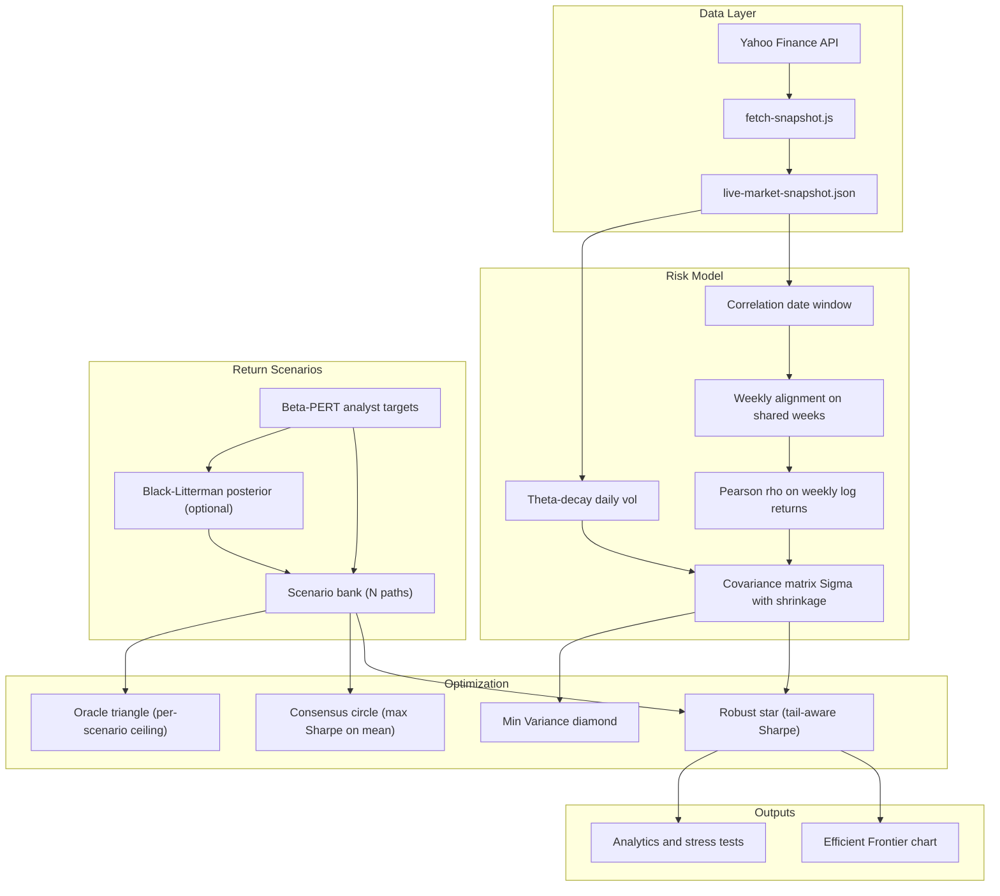

# IDX Portfolio Optimizer

A Monte Carlo portfolio optimizer for Indonesian large-cap equities. It pulls live market data from Yahoo Finance, samples analyst price-target distributions to build return scenarios, optionally blends them with Black-Litterman equilibrium views, and finds the allocation that maximizes a tail-aware Sharpe ratio under your sector and position constraints.

> **IDX context.** The default universe is ~25 `.JK` tickers covering the most liquid names on Bursa Efek Indonesia. Analyst 12-month price targets on IDX stocks average roughly 50 percentage points above the cap-weight equilibrium implied return — structural sell-side optimism that the Black-Litterman prior is specifically designed to counteract. The risk-free rate is live-fetched from the Bank Indonesia BI-Rate (5.75% as of mid-2026), with a hardcoded fallback in [`data/fetch-snapshot.js`](data/fetch-snapshot.js) if the fetch fails. The fallback rate is editable there; the universe lives in [`data/universe.js`](data/universe.js).

For recommended slider settings by universe type and risk posture, see [CALIBRATION.md](CALIBRATION.md). This document covers how each layer works; CALIBRATION.md covers what to set.

---

## Table of Contents

- [Quick Start](#quick-start)
- [How the App Works](#how-the-app-works)
- [Part I — Data Pipeline](#part-i--data-pipeline-yahoo--snapshot)
- [Part II — Correlation Matrix & Weekly Charts](#part-ii--correlation-matrix--weekly-charts)
- [Part III — Volatility (Theta Decay)](#part-iii--volatility-theta-decay)
- [Part IV — Expected Returns from Analyst Targets](#part-iv--expected-returns-from-analyst-targets)
- [Part V — Black-Litterman Factor Model](#part-v--black-litterman-factor-model)
- [Part VI — Tail-Aware Robust Optimization](#part-vi--tail-aware-robust-optimization)
- [Part VII — Portfolio Outputs & Constraints](#part-vii--portfolio-outputs--constraints)
- [Part VIII — UI Walkthrough](#part-viii--ui-walkthrough)
- [Reference Appendix](#reference-appendix)

---

## Quick Start

**Prerequisites:** Node 20 (matches CI), npm.

```bash
npm install
npm run dev       # auto-fetches a fresh snapshot before starting the dev server
```

The `predev` hook runs `fetch-snapshot` automatically, so you always start with current market data. To refresh data without restarting the server:

```bash
npm run fetch-snapshot    # full refresh: prices, vol, analyst targets
npm run refresh-sectors   # updates industry labels only (faster, no price fetch)
```

To build for static deployment:

```bash
npm run build             # runs fetch-snapshot then vite build
```

To run the math validation suite:

```bash
node scripts/validate-factors.mjs
```

The snapshot is written to `data/live-market-snapshot.json` and served via Vite's `publicDir` at `/live-market-snapshot.json`. The app fetches it on mount — no backend required.

**Related project.** Once you have optimized weights in the ANALYTICS tab, you can record them in the companion live dashboard at [`../live-dashboard-portfolio`](../live-dashboard-portfolio). That project tracks indexed performance against IHSG over time. See its [README](../live-dashboard-portfolio/README.md) for the rebalance workflow.

---

## How the App Works

The app has four tabs that correspond to four stages of the workflow:

1. **WORKSPACE** — define the asset universe, set constraints (sector caps, position limits), choose the volatility half-life, configure the factor model, and set the tail penalty λ.
2. **CORRELATION** — pick the weekly price history window; the app computes the Pearson correlation matrix ρ from that range.
3. **SIMULATION** — click REGENERATE to build the scenario bank and run Monte Carlo optimization. The result is an Efficient Frontier scatter with several labeled portfolios.
4. **ANALYTICS** — inspect weights, risk contributions, tail metric comparisons across λ values, stress scenarios, IHSG benchmark metrics, and a rebalance trade list.



> **When to click REGENERATE.** The simulation result is cached for a given `(universe, correlation window, factor config, iterations)` combination. You need to regenerate when: you toggle assets on or off; you change the correlation date window; you adjust any factor model or tail penalty setting; or you want a fresh random draw from the scenario bank.

---

## Part I — Data Pipeline: Yahoo → Snapshot

**Source:** [`data/fetch-snapshot.js`](data/fetch-snapshot.js)

The snapshot is a single JSON file that captures everything the optimizer needs: price history for correlation and charts, daily returns for volatility, analyst targets for return scenarios, and fundamental data for the factor model and liquidity constraints.

### What gets fetched

For each ticker in the universe ([`data/universe.js`](data/universe.js), 25 IDX symbols by default, queried with the `.JK` suffix):

- **Weekly adjusted-close prices** via `chart({ period1: '2011-01-01', interval: '1wk' })` — `chart()` is used deliberately because `historical()` throws on partial-null rows. The result is then post-filtered (`throughDate`) to the last completed Friday to exclude Yahoo's in-progress weekly bar, which carries unstable adjusted-close values.
- **Daily close prices** covering ~400 calendar days (≥252 trading days), used for volatility computation.
- **`quoteSummary`** modules: `financialData` (analyst targets, dividend yield), `summaryDetail` (market cap), `defaultKeyStatistics` (float shares), `assetProfile` + `summaryProfile` (industry label, ADT proxies).

The IHSG benchmark (`^JKSE`) weekly history is also fetched and stored separately for benchmark analytics.

### Snapshot schema

**Top-level fields:**

| Field | Description |
|-------|-------------|
| `generated` | ISO timestamp of when the snapshot was written |
| `riskFreeRate` | Bank Indonesia BI-Rate (decimal, e.g. `0.0575`), live-fetched at snapshot time |
| `historyRange` | `{ start, end }` of the full weekly history window |
| `benchmark` | `{ ticker, priceHistory }` for IHSG |
| `assets[]` | Array of per-asset objects (see below) |

**Per-asset fields:**

| Group | Fields | Notes |
|-------|--------|-------|
| Identity | `ticker`, `name`, `sector` | `sector` is Yahoo's **industry** label (e.g. "Banks", "Conglomerates"), not the broader GICS sector. Used for sector concentration caps. |
| `meta` | `currentPrice`, `dividendYield`, `marketCap`, `averageVolume`, `floatShares`, `sharesOutstanding`, `avgDailyTurnover`, `freeFloatPct` | Fundamental snapshot at fetch time |
| `meta` (vol) | `dailyReturns[]`, `recentDailyVol`, `volHalfLife` | Pre-computed at default half-life of 63 trading days; UI slider recomputes live |
| `forwardEstimates` | `lowTarget`, `meanTarget`, `highTarget`, `totalAnalysts` | 12-month analyst consensus from `financialData` |
| `priceHistory` | `{ interval: '1wk', dates[], adjClose[] }` | Full weekly history from 2011 onward |

### Operational notes

- To change the universe, edit `UNIVERSE_JK` in [`data/universe.js`](data/universe.js) (shared by all three apps' fetch scripts) and re-run `npm run fetch-snapshot`.
- `refresh-sectors.js` re-fetches only the `assetProfile`/`summaryProfile` modules and updates industry labels without touching price or analyst data. Use it when sector classifications drift without a price refresh.
- Sector label resolution — including fallback logic for tickers Yahoo misclassifies — lives in [`src/math/assetSector.js`](src/math/assetSector.js).

---

## Part II — Correlation Matrix & Weekly Charts

**Sources:** [`src/math/matrixEngine.js`](src/math/matrixEngine.js), [`src/components/CorrelationExplorer.jsx`](src/components/CorrelationExplorer.jsx)

The correlation matrix ρ is the structural input to the covariance matrix Σ. Getting its date range right is the single most consequential user decision in the workflow.

### Why weekly frequency

Daily returns on IDX stocks are noisy enough that correlation estimates are unstable over short windows. Weekly returns smooth out microstructure effects while retaining meaningful co-movement signal. The weekly interval also matches the snapshot's `priceHistory` interval, so no additional fetching is needed.

### Week alignment

IDX tickers do not all anchor their weekly bars on the same weekday. Most `.JK` names use Tuesday; some listings (notably NCKL) use Sunday. If left uncorrected, naive week-bucketing would slip Sunday-anchored bars into the adjacent ISO week, producing a false one-week lag in correlations with Tuesday-anchored tickers.

The function `canonicalWeeklyKey()` in `matrixEngine.js` normalizes this: Sunday dates are advanced by two days to the matching Tuesday; other weekdays are mapped to the Tuesday of the same Monday–Sunday calendar week.

### Intersection alignment

After canonicalization, the app computes the **intersection** of all active assets' week sets — only weeks where every enabled asset has a price are used. This is why the youngest listing in the active universe limits how far back the correlation can go: once you enable an asset that listed in 2022, the shared history starts in 2022 regardless of when the other tickers listed.

The function `alignedHistoryRange(assets)` returns `{ min, max }` over this intersection, which the CORRELATION tab uses to set the default date range and constrain the date pickers.

### User-controlled window

The date pickers in the CORRELATION tab set `[corrStart, corrEnd]`. Both the ρ matrix computation and the price chart are filtered to this range. The "Max range" preset sets `corrStart = aligned.min` and `corrEnd = today`.

### Correlation computation

Within the selected window, the app computes **percent log-returns** between consecutive aligned weeks for each asset, then applies Pearson r pairwise. If the selected window yields fewer than `MIN_CORR_OBS = 20` return observations, the simulation automatically expands to the full aligned range rather than producing an unreliable ρ estimate from too few data points.

### Stale correlation state

When you toggle assets on or off in the WORKSPACE tab, a `corrStale` flag is set. The simulation will refuse to run until you click **REGENERATE CORRELATION** on the CORRELATION tab, which re-aligns the week intersection for the new universe and recomputes ρ. This prevents running a simulation with a ρ matrix that doesn't match the active universe.

### What the chart shows

The CORRELATION tab renders an indexed performance chart (all assets rebased to 100 at `corrStart`) with per-ticker visibility toggles and a dashed IHSG overlay. This chart shares the same date range as ρ, so you can see what market environment the correlation was estimated from.

---

## Part III — Volatility (Theta Decay)

**Source:** [`src/math/matrixEngine.js`](src/math/matrixEngine.js) — `computeThetaDecayedVol`, `resolveDailyVol`

### The problem with equal-weight rolling windows

A standard 252-day rolling volatility treats a return from 251 days ago identically to yesterday's return. For equities, this means a market shock 8 months ago permanently influences the volatility estimate until it rolls off a cliff. The result is an artificially high or low σ depending on when the shock occurred relative to the window boundary.

Theta-decay weighting solves this by assigning exponentially declining importance to older observations. Recent days matter most; old days fade continuously rather than dropping off abruptly.

### Formula

```
w(age) = 0.5^(age / halfLife)
```

where `age` is the number of trading days before the most recent observation. At `halfLife = 63`, an observation from one quarter ago carries exactly half the weight of today's observation.

The weighted variance and mean are computed from up to 252 daily log-returns, then annualized:

```
σ_daily  = sqrt( Σ w(age) × (r_t − μ_w)² / Σ w(age) )
σ_annual = σ_daily × √252
```

| Parameter | Default | UI control |
|-----------|---------|------------|
| Half-life | 63 trading days (one quarter) | WORKSPACE slider, range 5–126 |
| Lookback | 252 daily returns | Fixed |
| Fallback σ_daily | 0.015 | Applied when history is too short |

### Runtime behavior

`fetch-snapshot.js` pre-computes `recentDailyVol` at the default half-life of 63 and stores it in the snapshot alongside the raw `dailyReturns[]` array. The WORKSPACE slider calls `resolveDailyVol(asset, halfLife)`, which re-weighs the stored daily returns live without requiring a re-fetch. This means you can explore different half-life assumptions instantly.

### Building the covariance matrix

Once per-asset annualized volatilities σ_i are resolved and the Pearson correlation matrix ρ is computed, the covariance matrix is assembled elementwise:

```
Σ_ij = ρ_ij × σ_i × σ_j
```

Two optional augmentation layers can modify Σ before it reaches the optimizer:

**Covariance shrinkage.** When the number of correlation observations is small relative to the number of assets (a common situation when the newest listing limits the window), the sample correlation matrix is noisy and can have near-zero or negative eigenvalues that destabilize optimization. The shrinkage step blends the sample Σ toward a scaled identity matrix with a heuristic data-driven intensity α ∈ [0,1] (a convex combination, so the result stays symmetric PSD), improving conditioning. The function is named `ledoitWolfShrinkage` for historical reasons, but the intensity formula is *not* the formal Ledoit-Wolf estimator (which needs the raw observation vectors). Enabled by default via `simConfig.shrinkage = true`; applies only when `nObs > n`.

**Liquidity diagonal inflation.** When the factor model is active and `portfolioSize > 0` (AUM is set), the diagonal entries of Σ are inflated for illiquid assets:

```
Σ_ii → Σ_ii × (1 + liquidityPenalty × (1 − liquidityScore_i))
```

This makes the optimizer treat illiquid assets as riskier than their price volatility alone suggests, reducing their weight organically through the optimization. The liquidity scores and penalties are computed in [`src/math/qualityFactors.js`](src/math/qualityFactors.js).

---

## Part IV — Expected Returns from Analyst Targets

**Sources:** [`src/math/monteCarlo.js`](src/math/monteCarlo.js), [`src/math/returns.js`](src/math/returns.js)

The optimizer needs a distribution of expected returns, not just a single point estimate. Rather than assuming returns are normally distributed around a mean, the app samples from analyst price-target ranges to generate realistic scenario spreads — capturing both the uncertainty within analyst consensus and the disagreement across scenarios.

### Input data

Yahoo `forwardEstimates` provides three values per asset: `lowTarget`, `meanTarget`, `highTarget`, and `totalAnalysts`. These are interpreted as 12-month forward **price** targets. The current price and dividend yield are taken from `meta`.

### Beta-PERT sampling (legacy mode, factor model OFF)

The Beta-PERT distribution is a bounded distribution parameterized by minimum, most likely, and maximum values. It is commonly used in project risk modeling precisely because it respects the bounds of plausible outcomes while concentrating probability near the mode.

For each Monte Carlo path, a price target is sampled for each asset:

```
μ_PERT  = (lowTarget + 4 × meanTarget + highTarget) / 6

range   = highTarget − lowTarget
α1      = 1 + 4 × (μ_PERT − lowTarget) / range
α2      = 1 + 4 × (highTarget − μ_PERT) / range

sampledPrice = lowTarget + Beta(α1, α2) × range
```

The sampled price is converted to an annualized return by adding the dividend yield:

```
μ_i = (sampledPrice − currentPrice) / currentPrice + dividendYield
```

Because analyst targets are 12-month forward prices, the resulting returns are directly comparable to the risk-free rate (5.75% annual) without any time-scaling.

### Dispersion metric

The spread between the low and high targets, normalized by the mean, measures how much analysts disagree on a given name:

```
dispersion_i = (highTarget − lowTarget) / meanTarget
```

This metric appears later in the Black-Litterman view uncertainty formula as a per-stock signal of target reliability.

### Monte Carlo scale

| Setting | Default | Notes |
|---------|---------|-------|
| MC paths | 100,000 | Full scenario bank; user-adjustable 1k–100k |
| Optimizer subsample | 1,000 | Default; adjustable 1k–20k in the WORKSPACE panel. Used during hill-climbing to keep the landscape stable |
| Chart subsample | 2,500 | Fixed; max points sent to Recharts for the scenario cloud |

### Scenario bank

The full set of N scenario return vectors (each a sampled μ for every active asset) is built once per `(universe, correlation window, factor config, MC iterations)` combination. This bank is reused when comparing Robust ★ at different λ values on the Efficient Frontier — the same scenarios are evaluated under each penalty level, keeping the comparison apples-to-apples. "Refresh bank" forces a new random draw from the PERT distributions.

---

## Part V — Black-Litterman Factor Model

**Sources:** [`src/math/blackLitterman.js`](src/math/blackLitterman.js), [`src/math/factorConfig.js`](src/math/factorConfig.js), [`src/math/qualityFactors.js`](src/math/qualityFactors.js)

The Black-Litterman model solves a fundamental problem with mean-variance optimization: when you feed raw analyst targets directly into an optimizer, the result tends to concentrate aggressively in the names with the highest expected returns, ignoring the fact that those targets may be structurally inflated (as they are on IDX). BL anchors each asset's expected return to a market-equilibrium prior and then blends the analyst view toward that anchor proportionally to how much you trust it.

**Toggle:** `useFactorModel` in the WORKSPACE factor panel (default OFF → pure PERT sampling). When OFF, each scenario's μ vector comes directly from the PERT sampler described in Part IV. When ON, those PERT samples become the **views** Q fed into the BL posterior.

### How BL modifies each MC path

For each scenario path when the factor model is active:

1. Sample a PERT view return for each asset → the view vector **Q** (absolute views, `P = I`).
2. Compute the equilibrium return vector **π** from market cap weights.
3. Blend π and Q via the BL posterior formula → the scenario's **μ** vector used by the optimizer.

### Equilibrium returns

The equilibrium return for each asset is derived from the CAPM relationship:

```
π = δ × Σ × w_mkt
```

where:
- **δ** is the implied market risk aversion, derived from an assumed 8% equity premium above the risk-free rate applied to the cap-weighted market variance
- **Σ** is the covariance matrix computed in Part III
- **w_mkt** are cap weights, shaped by the large-cap bias parameter:

```
w_mkt_i ∝ marketCap_i^(1 − 2 × largeCapBias)
```

At `largeCapBias = 0`, this is pure market-cap weighting. At `0.5`, all assets receive equal weight. At `1.0`, the weighting tilts toward smaller caps.

### View uncertainty (Ω)

The diagonal matrix Ω encodes how much the optimizer should trust each analyst view. A larger ω_i means "this view is uncertain — stay closer to equilibrium π." The formula is:

```
ω_i = omegaScale × Σ_ii × (1 + dispersionOmega × dispersion_i)² × (maxAnalysts / analysts_i)^analystConfidence
```

where:
- **omegaScale** (hardcoded at 0.05) sets the baseline uncertainty level relative to asset variance
- **dispersion_i** = `(high − low) / mean` from Part IV — wide target spread → higher ω
- **dispersionOmega** (UI slider, 0–100%) controls how strongly target spread inflates uncertainty
- **maxAnalysts** = the highest analyst count in the active universe
- **analysts_i** = analyst count for asset i — fewer analysts → higher ω
- **analystConfidence** (UI slider, 0–100%) controls the exponent on analyst coverage

This formulation is **decoupled from τ** (see below). The uncertainty ω_i is set in absolute terms relative to Σ_ii, so changing τ genuinely moves the π-vs-Q blend rather than having τ and Ω cancel each other out.

### BL posterior

```
μ_BL = [(τΣ)⁻¹ + Ω⁻¹]⁻¹ [(τΣ)⁻¹ π + Ω⁻¹ Q]
```

where:
- **τ** (UI slider, 0.005–0.15) scales the prior precision. Lower τ → μ_BL anchors toward π (skeptical of analysts). Higher τ → μ_BL follows Q more closely.
- The matrix inversion is pre-computed once per scenario bank build and reused across all paths for efficiency.

### IDX calibration context

> On IDX, analyst 12-month targets average roughly 50 percentage points above the cap-weight equilibrium implied return — a gap of approximately 1.5 annualized σ for a typical large-cap name. The default `τ = 0.03` places μ_BL at roughly 40–45% of the way toward the analyst view for a large-cap name with 20+ analysts, providing meaningful BL shrinkage without ignoring the signal entirely. `omegaScale = 0.05` is hardcoded and not exposed as a UI slider; changing it would require editing `src/math/factorConfig.js` directly and is not recommended unless adapting the app for a non-IDX market with very different sell-side characteristics.

**Defaults:**

| Parameter | Default | UI range | Notes |
|-----------|---------|----------|-------|
| `useFactorModel` | OFF | Toggle | Master switch |
| `useBlackLitterman` | ON | Toggle | Sub-option when factor model is ON |
| `useCapPrior` | ON | Toggle | Builds π from market caps |
| `useAnalystViews` | ON | Toggle | Uses analyst targets as Q |
| `tau` | 0.030 | 0.005–0.15 | IDX default; conservative skepticism of sell-side |
| `omegaScale` | 0.05 | Hardcoded | IDX-calibrated; edit `factorConfig.js` to change |
| `analystConfidence` | 0.70 | 0–1 slider | Exponent on analyst coverage ratio |
| `dispersionOmega` | 0.80 | 0–1 slider | Multiplier on target dispersion in Ω |
| `largeCapBias` | 0.25 | 0–1 slider | 0 = cap-weight, 0.5 = equal, 1 = small-cap |
| `useLiquidityRisk` | ON | Toggle | Σ diagonal inflation for illiquid names |
| `portfolioSize` | 0 | Input (IDR) | 0 = no AUM-based caps |

For recommended values by universe type, see [CALIBRATION.md](CALIBRATION.md).

---

## Part VI — Tail-Aware Robust Optimization

**Sources:** [`src/math/robustObjective.js`](src/math/robustObjective.js), [`src/math/simConfig.js`](src/math/simConfig.js)

Standard mean-variance optimization maximizes Sharpe ratio on expected returns. The problem is that "expected return" in a Monte Carlo simulation is an average across scenarios — it ignores how bad things get in the bad scenarios. A portfolio with a great average but catastrophic tail outcomes is not what most investors want.

The tail-aware objective penalizes the gap between the expected return and the expected shortfall of the worst outcomes, directly trading off some average performance for tail protection.

### Optimization modes

| Mode | Objective function | When to use |
|------|--------------------|-------------|
| `tailAware` (default) | Sharpe(avg μ) − λ × (tailGap / σ_ref) − κ × turnover | Production use |
| `avgMuSharpe` (legacy) | Sharpe on average scenario returns only | Debugging; comparison baseline |

### Tail metrics

**tailGap** is the distance between the mean scenario return and the Conditional Value at Risk at the 5th percentile (expected shortfall of the worst 5% of scenarios):

```
tailGap = E[r] − CVaR₅%
```

A large tailGap means the portfolio does well on average but has severe downside in bad scenarios. The optimizer penalizes this.

**σ_ref** is the equal-weight portfolio's standard deviation, computed once from the same covariance matrix Σ. It normalizes λ so that "λ = 0.10" means the same thing regardless of whether the universe is high-vol or low-vol:

```
Objective = Sharpe(w, avg μ) − λ × (tailGap / σ_ref) − κ × turnover
```

where:
- **λ** (`tailPenalty`) is the tail penalty weight. Default 0.10 — a light cushion that yields near-maximum Sharpe with modest CVaR improvement.
- **κ** (`turnoverPenalty`) penalizes one-way turnover from the current holdings entered in the WORKSPACE holdings input. Default 0 (disabled).

For guidance on choosing λ and κ by risk posture, see [CALIBRATION.md](CALIBRATION.md).

### Realized returns for tail evaluation

To evaluate tail metrics, the optimizer draws correlated return shocks using the Cholesky decomposition of Σ. For each scenario path:

```
z ~ N(0, I_n)           (independent standard normals)
ε = L · z               (correlated shocks, ε ~ N(0, Σ))
r_j = exp(ln(1+μ_j) − Σ_jj/2 + ε_j) − 1    (lognormal realized return)
r_p = w · r_vec         (portfolio realized return)
```

These realized returns are sorted to compute the empirical CVaR₅%.

### Anti-overfit design

The robust optimizer is deliberately conservative about fitting to the scenario sample:

- The **optimizer** sees a subsample (default 1,000, adjustable 1k–20k) of paths evenly spaced from the full bank. The hill-climbing landscape is stable across function evaluations within a run.
- The **reporting** (CVaR, P10/P50/P90 in Analytics) uses all N paths for accurate tail estimates.
- The **tailGap** penalty is a smooth average-based measure rather than a worst-case min-max, making it less sensitive to outlier scenarios.
- **Deterministic seed portfolios** (tangency, equal-weight, min-variance, cap-corner allocations) ensure the optimizer starts from high-quality positions before random perturbation.

### λ sweep (robustness frontier)

The Efficient Frontier chart includes a robustness frontier sweep across 7 preset λ values: `[0, 0.10, 0.20, 0.35, 0.50, 0.75, 1.0]`. Each point represents the Robust ★ portfolio at that λ. The ANALYTICS tab provides a comparison table showing P10/P50/P90 return, CVaR₅%, and tailGap for each λ, helping you visualize the trade-off between average performance and tail protection.

---

## Part VII — Portfolio Outputs & Constraints

**Sources:** [`src/math/monteCarlo.js`](src/math/monteCarlo.js), [`src/math/sectorCaps.js`](src/math/sectorCaps.js)

### Portfolio types on the Efficient Frontier

Each labeled marker on the Efficient Frontier chart represents a distinct portfolio. Understanding what each one is — and which are actually investable — is essential for interpreting the ANALYTICS tab.

| Portfolio | Symbol | Investable | Description |
|-----------|--------|-----------|-------------|
| **Robust** | ★ | Yes | Fixed weights from the tail-aware objective; this is the portfolio you would trade |
| **Consensus** | ◎ | Yes | Max Sharpe on a single point estimate (the mean BL or PERT return vector) — ignores scenario uncertainty |
| **Oracle** | ▲ | No | Best Sharpe among all per-scenario optimal allocations — an impossible ceiling that shows how much better a perfect forecaster could do |
| **Min Variance** | ◆ | Yes | Minimum portfolio variance subject to caps — ignores expected return entirely |
| **Scenario cloud** | Purple dots | — | Per-path max Sharpe allocations — shows the dispersion of scenario-optimal weights |
| **Robust heat-map** | Teal dots | — | The fixed Robust ★ weights evaluated under each scenario — shows Robust ★ risk-return distribution |

The gap between Oracle ▲ and Consensus ◎ reflects the degree of return-scenario dispersion: a wide gap means analyst targets vary a lot across paths, and the BL/PERT model is generating meaningfully different scenarios. The gap between Consensus ◎ and Robust ★ reflects the cost of tail protection.

### Constraints

**Sector caps.** Each industry group (as labeled by Yahoo's `assetProfile.industry`) has an upper bound on total weight. The default is 80%, with a minimum of 5%. Sliders per industry group appear in the WORKSPACE tab. Constraint enforcement: clip each sector's total weight to its cap → redistribute the excess proportionally across other sectors → top up to 100%.

**Global position cap.** An optional upper bound on any single asset's weight. Default is 100% (off). Set to 25–40% to enforce concentration limits.

**Per-asset caps.** Individual assets can have custom maximum weights, set in the WORKSPACE asset table.

**ADT-based caps (AUM mode).** When `portfolioSize > 0`, the app computes a safe maximum position for each asset as a fraction of its average daily turnover (ADT) — specifically, what can be accumulated or unwound over approximately 5 trading days at 10% of average daily volume. This creates automatic position caps for illiquid names that scale with portfolio size.

### Stress tests

The ANALYTICS tab runs four fixed stress scenarios via `evaluateStressScenarios`:

| Scenario | Return inputs |
|----------|---------------|
| All Mean | Each asset's mean analyst target return |
| All Low (Bear) | Each asset's low analyst target return |
| All High (Bull) | Each asset's high analyst target return |
| Per-sector downside | Mean targets with one sector at its low, repeated for each sector |

Each stress scenario reports the portfolio return, and the per-sector downside scenarios show which sector concentration represents the largest individual stress exposure.

---

## Part VIII — UI Walkthrough

### WORKSPACE tab

The WORKSPACE tab is where you configure everything before running the simulation.

**Asset universe.** Toggle individual assets on or off using the checkboxes in the asset table. The table shows each asset's current price, annualized volatility (live-computed at the current half-life setting), analyst upside, and dividend yield. Disabling an asset removes it from correlation, covariance, and optimization — the `corrStale` flag will require a REGENERATE CORRELATION before the next simulation.

**Sector & position caps.** Industry sliders set the maximum total weight for each sector. The global position cap slider limits any single asset. Individual asset max-weight overrides are available per row.

**Volatility half-life.** A slider from 5 to 126 trading days. Quick-select buttons at 21, 42, 63, 84, and 126 days. Changes take effect immediately in the asset table's σ column without requiring REGENERATE.

**MC iterations.** 1,000 to 100,000 paths. Higher counts improve tail-metric precision but increase compute time. For exploratory tuning, 10,000–50,000 is a reasonable balance.

**Factor model panel.** All Black-Litterman controls: master toggle, sub-option toggles (BL, cap prior, analyst views), τ slider, analystConfidence, dispersionOmega, largeCapBias, liquidity risk toggle, and portfolio size (AUM in IDR).

**Tail penalty λ.** Slider from 0 to 1.0 with quick-select buttons at the 7 preset frontier values.

**Holdings input.** Enter current weights for turnover penalty (κ) calculation. When κ > 0, the optimizer penalizes allocations that deviate from these holdings, producing a stickier rebalance.

### CORRELATION tab

**Date pickers.** Set `corrStart` and `corrEnd`. The picker constrains the range to the aligned intersection of active assets' weekly histories.

**Max range preset.** Sets start to the aligned history minimum and end to today in one click.

**REGENERATE CORRELATION.** Required after changing the active universe. Recomputes week alignment and ρ for the new universe. Until this is done, the simulation button is disabled.

**ρ heatmap.** Displays the full Pearson correlation matrix as a color grid. Values range from -1 (dark red) to +1 (dark blue), with the diagonal at 1.

**Price chart.** Indexed performance of all active assets (rebased to 100 at `corrStart`) with per-ticker toggles and a dashed IHSG overlay. Useful for seeing what market regime the correlation was estimated from.

### SIMULATION tab

**REGENERATE (simulation).** Runs the full Monte Carlo: builds the scenario bank, evaluates objective functions, runs the λ-sweep frontier, and renders the Efficient Frontier chart.

**Efficient Frontier chart.** Shows the scenario cloud (purple), robust heat-map (teal), and the four labeled portfolios (★ ◎ ▲ ◆). The λ-sweep frontier is rendered as a connected path of Robust ★ positions across the 7 preset λ values. Hover over any point for return, risk, and Sharpe ratio.

### ANALYTICS tab

**Weight breakdown.** The selected portfolio's weights by asset and sector, with risk contributions (each asset's fractional contribution to total portfolio variance).

**λ comparison table.** Rows for each of the 7 λ preset values, columns for P10/P50/P90 return, CVaR₅%, tailGap, and Sharpe. Use this to pick a λ that matches your risk posture before finalizing weights.

**IHSG benchmark metrics.** Beta, correlation, active risk (tracking error), and individual portfolio and benchmark volatilities — computed by [`src/math/benchmarkMetrics.js`](src/math/benchmarkMetrics.js). These are descriptive metrics, not optimizer constraints.

**Stress scenarios.** The four fixed stress tests with portfolio return for each.

**Rebalance trade list.** Given the current holdings entered in WORKSPACE, this table shows the target weights, current weights, and the trades (buy/sell by weight or IDR if AUM is set) needed to move from current to optimal. One-way turnover is shown as a percentage and IDR amount.

---

## Reference Appendix

### Configuration defaults

| Parameter | Default | Source constant | Notes |
|-----------|---------|----------------|-------|
| Vol half-life | 63 days | `DEFAULT_VOL_HALF_LIFE` | One quarter |
| Vol lookback | 252 days | `VOL_LOOKBACK_DAYS` | Fixed |
| Fallback σ_daily | 0.015 | `FALLBACK_DAILY_VOL` | Applied when fewer than 2 daily return observations are available |
| Min corr observations | 20 | `MIN_CORR_OBS` | Auto-expands window if below |
| Risk-free rate | 0.0575 | `DEFAULT_RF` | BI-Rate; live-fetched, this is the fallback |
| MC iterations | 100,000 | `DEFAULT_MC_ITERATIONS` | Slider range 1k–100k |
| Optimizer subsample | 1,000 | `ROBUST_SUBSAMPLE_SIZE` | Default; UI control 1k/5k/10k/20k |
| Chart subsample | 2,500 | `CHART_MAX_POINTS` | Fixed; max Recharts points |
| Tail penalty λ | 0.10 | `DEFAULT_TAIL_PENALTY` | `tailAware` mode default |
| Turnover penalty κ | 0 | `DEFAULT_SIM_CONFIG` | Off by default |
| Shrinkage | ON | `DEFAULT_SIM_CONFIG` | Heuristic scaled-identity (see Part III) |
| `useFactorModel` | OFF | `DEFAULT_FACTOR_CONFIG` | Master BL toggle |
| `tau` | 0.030 | `DEFAULT_FACTOR_CONFIG` | IDX conservative default |
| `omegaScale` | 0.05 | `DEFAULT_FACTOR_CONFIG` | Hardcoded; IDX-calibrated |
| `analystConfidence` | 0.70 | `DEFAULT_FACTOR_CONFIG` | Coverage-based Ω scaling |
| `dispersionOmega` | 0.80 | `DEFAULT_FACTOR_CONFIG` | Dispersion-based Ω scaling |
| `largeCapBias` | 0.25 | `DEFAULT_FACTOR_CONFIG` | Prior tilt; 0 = cap-wt |
| Sector cap default | 80% | `buildSectorCapsForSectors` | Per-industry |
| Min sector cap | 5% | `MIN_SECTOR_CAP` | Slider floor |
| Global position cap | 100% (off) | `DEFAULT_MAX_POSITION_CAP` | Slider range 5–100% |

### Source file index

```
portfolio-app/
├── optimizer-config.json        Headless-run defaults (methodology, factorConfig, MC iterations)
│
├── data/
│   ├── universe.js              Canonical ticker universe (UNIVERSE_JK) — shared by all 3 apps
│   ├── fetch-snapshot.js        Yahoo Finance fetch; writes live-market-snapshot.json
│   ├── refresh-sectors.js       Lightweight sector/label refresh (no price re-fetch)
│   ├── view-history/            Weekly point-in-time analyst-view captures (for κ-replay)
│   └── live-market-snapshot.json  Runtime data (git-ignored or rebuilt on dev/build)
│
├── scripts/
│   ├── validate-factors.mjs    Math regression suite; run after changing math modules
│   ├── optimize.mjs             Headless optimizer (weekly rebalance; --methodology/--prior-mode/--tau/--emit)
│   └── seed-forward-matrix.mjs  Sequential, resumable 10-config matrix seeder
│
└── src/
    ├── App.jsx                  Four-tab UI orchestration; simulation state machine
    ├── main.jsx                 React mount
    ├── sectorColors.js          Industry → chart color mapping
    │
    ├── components/
    │   ├── CorrelationExplorer.jsx  Date-range picker, ρ heatmap, indexed price chart
    │   └── EfficientFrontier.jsx   Scatter chart with scenario cloud + labeled markers
    │
    └── math/
        ├── matrixEngine.js      Pearson ρ, theta-decay σ, Σ assembly, Cholesky, shrinkage
        ├── monteCarlo.js        MC engine: PERT sampling, BL integration, λ-sweep frontier
        ├── blackLitterman.js    BL posterior formula, equilibrium π, view uncertainty Ω
        ├── factorConfig.js      DEFAULT_FACTOR_CONFIG, τ/omegaScale design notes
        ├── qualityFactors.js    Cap weights, factor preview, AUM/ADT liquidity caps
        ├── robustObjective.js   Tail-aware objective, CVaR, correlated shock draws
        ├── simConfig.js         DEFAULT_SIM_CONFIG, tail penalty defaults
        ├── sectorCaps.js        Sector cap resolution, constraint enforcement logic
        ├── returns.js           Upside helpers, dispersion, dividend yield utilities
        ├── benchmarkMetrics.js  Beta, active risk, tracking error vs IHSG
        └── assetSector.js       Yahoo industry label resolver and fallback logic
```

### Tech stack

| Layer | Technology |
|-------|-----------|
| Frontend | React 18, Vite 5 |
| Charts | Recharts 2 |
| Data fetch | yahoo-finance2 v3 (Node.js, ESM) |
| Math | Pure JavaScript, no external numeric library |

### Validation script

`scripts/validate-factors.mjs` runs a suite of regression tests covering:
- Legacy PERT-only mode (factor model OFF)
- Tail-aware objective with various λ values
- Factor model + BL posterior with shrinkage
- Consensus portfolio vs full MC output
- Stress scenario evaluation

Run it after modifying any file in `src/math/` to catch regressions before they reach the UI.
